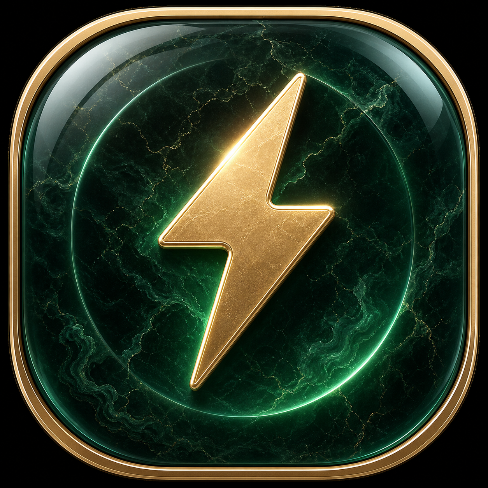
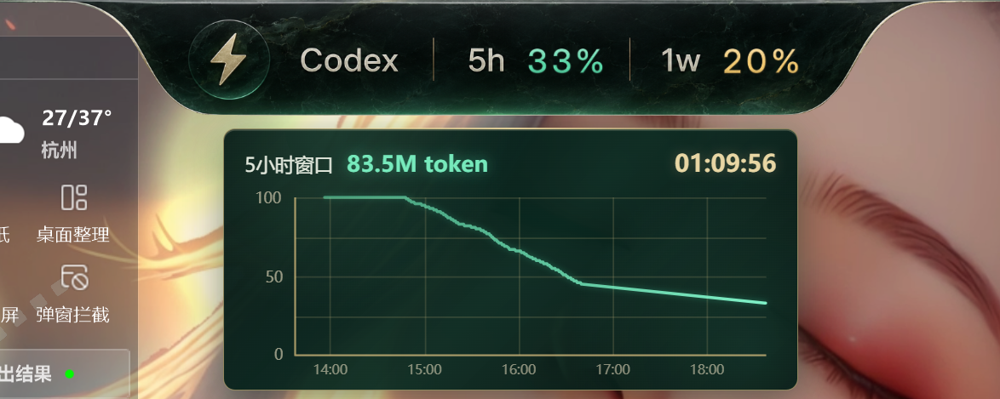
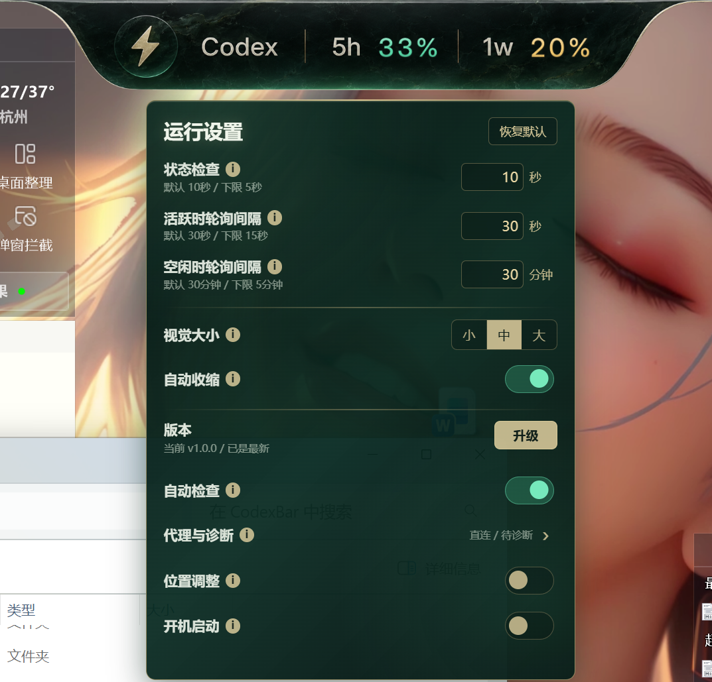

<div align="center">
  
  <h1>CodexBar</h1>
  <p><strong>一条贴在桌面顶部的 Codex 额度、活跃状态与 token 用量状态栏。</strong></p>
  <p>
    <a href="#中文">中文</a>
    ·
    <a href="#english">English</a>
  </p>
  <p>
    
    
    
    
    
  </p>
</div>

<div align="center">
  
  <br />
  
</div>

---

## 中文

CodexBar 是一个 Windows 托盘式桌面小工具。它读取本机 Codex 的额度与线程状态，把 5 小时窗口、一周窗口、忙碌状态、历史曲线、token 用量和运行设置压进一条透明顶栏里。

它默认不出现在任务栏，不弹普通窗口。主界面就是桌面顶部的 Bar；托盘菜单保持干净，只保留退出。

### 亮点

- **额度顶栏**：显示 Codex 5 小时额度和一周额度。
- **真实数字资产**：额度数字使用 PNG 字形资产渲染，不是普通 CSS 文字。
- **滚动动画**：额度变化时，数字有轻量滚动过渡。
- **活跃状态闪电**：检测到 Codex 线程活跃时，左侧闪电图标会发光闪动。
- **悬浮详情面板**：指向 `5h` 或 `1w` 可查看重置倒计时、额度历史曲线和 token 用量。
- **运行设置面板**：指向 `Codex` 可设置轮询频率、视觉大小、自动收缩、位置调整、开机启动和更新检查。
- **代理与诊断二级菜单**：在设置面板里悬停 `代理与诊断`，可设置 GitHub Release 下载代理并查看运行诊断。
- **透明区域穿透**：Bar 的透明像素不会挡住下面窗口；收缩后也尽量保持可点击穿透。
- **托盘式体验**：启动后不显示任务栏图标，右键托盘只显示 `退出软件`。
- **自动升级**：可检查 GitHub Release；有新版本时显示红点，下载完成后拉起安装程序并退出 CodexBar。

### 界面与交互

| 区域 | 行为 |
| --- | --- |
| `Codex` | 悬停打开运行设置面板。 |
| `5h` | 悬停打开 5 小时窗口详情：重置倒计时、额度曲线、过去 5 小时 token。 |
| `1w` | 悬停打开一周窗口详情：重置倒计时、额度曲线、过去一周 token。 |
| 闪电图标 | Codex 线程处于 `running` / `active` 或 session 近期写入时发光。 |
| 不透明 Bar 区域 | 开启位置调整后可拖动；右键可打开自绘退出菜单。 |
| 透明区域 | 鼠标穿透到底层窗口。 |

### 设置项

- `状态检查`：检查 Codex 是否有活跃线程的间隔，默认 10 秒，下限 5 秒。
- `活跃时轮询间隔`：Codex 活跃时读取额度的间隔，默认 30 秒，下限 15 秒。
- `空闲时轮询间隔`：Codex 空闲时读取额度的间隔，默认 30 分钟，下限 5 分钟。
- `视觉大小`：小 / 中 / 大，影响 Bar 和悬浮面板的整体尺寸。
- `自动收缩`：空闲时收进屏幕顶部，仅保留细小视觉提示，鼠标指向后展开。
- `自动检查`：每 24 小时检查一次 GitHub Release。
- `代理与诊断`：二级菜单，包含下载代理输入和运行诊断。
- `位置调整`：开启后可按住 Bar 的不透明区域横向拖动，松手后吸附到当前屏幕顶部。
- `开机启动`：登录 Windows 后自动启动 CodexBar。

### Token 用量

CodexBar 从本机 Codex session JSONL 中读取 `token_count` 事件：

- 默认路径：`%USERPROFILE%\.codex\sessions`
- 自定义路径：设置 `CODEX_HOME` 后读取 `%CODEX_HOME%\sessions`
- 显示单位：`K token` / `M token` / `G token`
- 缓存方式：按分钟聚合，保留最近一周左右的数据桶
- 统计窗口：面板里分别显示过去 5 小时和过去一周的 token 用量

CodexBar 退出期间，只要 Codex 继续把 token 数据写入 session 文件，下一次启动会重新从文件聚合补回来。

### 更新代理怎么填

`代理与诊断` 里的下载代理是一个 **URL 前缀**。CodexBar 会把 GitHub Release 安装包的完整下载地址拼在它后面。

例如你填写：

```text
https://gh-proxy.example.com/
```

实际下载时会请求：

```text
https://gh-proxy.example.com/https://github.com/Aecenas/CodexBar/releases/download/...
```

留空表示直连 GitHub。版本比较仍使用 GitHub API，代理只影响安装包下载。

### 安装与运行

从 GitHub Release 下载 `CodexBar Setup x.y.z.exe`，安装后双击启动即可。

当前公开构建未做代码签名，Windows 可能显示“未知发布者”或安全提醒。这是独立开发者未购买代码签名证书时的正常现象，不代表安装包一定有问题。

### 开发

环境要求：

- Windows 10 或更新版本
- Node.js 20 或更新版本
- npm
- 本机已安装并登录 Codex

安装依赖：

```powershell
npm install
```

开发模式：

```powershell
npm run dev
```

构建渲染层和 Electron 主进程：

```powershell
npm run build
```

生成 Windows 安装包：

```powershell
npm run dist
```

安装包输出在 `release/`。

### 项目结构

```text
CodexBar/
├─ electron/                 Electron 主进程、预加载脚本、Codex 读取逻辑
│  ├─ codexAppServerClient.ts
│  ├─ codexActivityDetector.ts
│  ├─ refreshScheduler.ts
│  ├─ tokenUsageReader.ts
│  └─ updateService.ts
├─ src/                      React UI
│  ├─ assets/                Bar 背景、数字资产、闪电特效
│  └─ ui/                    顶栏、额度面板、设置面板组件
├─ assets/                   app / tray / installer 图标
├─ docs/                     文档与展示图片
├─ .github/workflows/        GitHub Actions 发布流程
└─ package.json              构建与 electron-builder 配置
```

### 发布

本地发布包：

```powershell
npm run dist
```

GitHub Actions 自动发布：

1. 更新 `package.json` 的版本号。
2. 提交代码。
3. 创建并推送 tag，例如 `v1.0.1`。
4. `Release` workflow 会在 Windows runner 上执行 `npm ci` 和 `npm run dist`。
5. 生成的 `.exe`、`.blockmap` 和 `latest.yml` 会上传到对应 GitHub Release。

### FAQ

**为什么闪电没有亮？**  
CodexBar 优先读取 Codex app-server 的线程状态，兼容 `running` / `active`；如果读不到，会用最近 session 文件写入作为兜底。可以在 `代理与诊断` 里看当前命中来源。

**为什么额度显示 `--%`？**  
通常是 Codex app-server 不可用、Codex 未登录、网络异常或本机 Codex 状态暂时不可读。打开运行诊断可以看到最近一次额度读取错误。

**为什么安装时 Windows 提示未知开发者？**  
因为当前构建未签名。要消除该提示，需要购买并接入 Windows 代码签名证书。

**可以在非默认 `.codex` 目录下使用吗？**  
可以。设置 `CODEX_HOME`，CodexBar 会读取 `%CODEX_HOME%\sessions`。

### License

MIT

---

## English

CodexBar is a Windows tray utility that turns local Codex quota, thread activity, quota history, token usage, and runtime controls into a compact transparent desktop bar.

It does not create a normal taskbar window. The desktop bar is the primary UI, and the tray menu stays minimal with only an exit action.

### Highlights

- **Quota bar**: shows Codex 5-hour and weekly quota.
- **Image-rendered digits**: quota numbers use texture-matched PNG digit assets instead of plain CSS text.
- **Rolling digit animation**: quota changes animate with a subtle rolling effect.
- **Busy lightning effect**: the bolt glows when an active Codex thread is detected.
- **Hover detail panels**: hover `5h` or `1w` to see reset countdowns, quota history curves, and token usage.
- **Runtime settings panel**: hover `Codex` to configure polling, visual size, auto-collapse, position adjustment, startup, and update checks.
- **Proxy and diagnostics submenu**: hover `代理与诊断` in settings to configure a GitHub Release download proxy and inspect runtime diagnostics.
- **Transparent click-through**: transparent pixels avoid blocking the window underneath.
- **Tray-style shell**: no taskbar entry; the tray context menu only contains `退出软件`.
- **Release updater**: checks GitHub Releases, shows a red dot when updates exist, downloads the installer, launches it, and exits CodexBar.

### Interaction Map

| Area | Behavior |
| --- | --- |
| `Codex` | Hover to open runtime settings. |
| `5h` | Hover to open the 5-hour detail panel with reset countdown, quota curve, and 5-hour token usage. |
| `1w` | Hover to open the weekly detail panel with reset countdown, quota curve, and weekly token usage. |
| Bolt icon | Glows when a Codex thread is `running` / `active` or when recent session writes are detected. |
| Opaque bar pixels | Can be dragged when position adjustment is enabled; right-click opens a custom exit menu. |
| Transparent pixels | Pass mouse events through to the window underneath. |

### Settings

- `状态检查`: interval for checking whether Codex has an active thread. Default 10s, minimum 5s.
- `活跃时轮询间隔`: quota polling interval while Codex is active. Default 30s, minimum 15s.
- `空闲时轮询间隔`: quota polling interval while Codex is idle. Default 30min, minimum 5min.
- `视觉大小`: small / medium / large scaling for the bar and hover panels.
- `自动收缩`: retracts the bar into the top edge when idle, then expands on hover.
- `自动检查`: checks GitHub Releases every 24 hours.
- `代理与诊断`: secondary panel for download proxy settings and runtime diagnostics.
- `位置调整`: enables horizontal dragging from opaque bar pixels; release snaps the bar back to the top of the current screen.
- `开机启动`: starts CodexBar after Windows login.

### Token Usage

CodexBar reads local `token_count` events from Codex session JSONL files:

- Default path: `%USERPROFILE%\.codex\sessions`
- Custom path: set `CODEX_HOME`, then CodexBar reads `%CODEX_HOME%\sessions`
- Units: `K token` / `M token` / `G token`
- Cache: minute-level buckets retained for roughly one week
- Windows: 5-hour and 7-day token usage are calculated from those buckets

If CodexBar is closed while Codex keeps writing session files, CodexBar will rebuild the minute buckets from disk on the next launch.

### Download Proxy

The download proxy is a **URL prefix** used only for GitHub Release installer downloads.

If you enter:

```text
https://gh-proxy.example.com/
```

CodexBar downloads from:

```text
https://gh-proxy.example.com/https://github.com/Aecenas/CodexBar/releases/download/...
```

Leave it empty to download directly from GitHub. Version checks still use the GitHub API directly.

### Installation

Download `CodexBar Setup x.y.z.exe` from GitHub Releases and launch it.

Public builds are currently unsigned, so Windows may show an unknown-publisher warning. That is expected for unsigned independent builds.

### Development

Requirements:

- Windows 10 or newer
- Node.js 20 or newer
- npm
- Codex installed and authenticated on the local machine

Install dependencies:

```powershell
npm install
```

Run in development mode:

```powershell
npm run dev
```

Build renderer and Electron main process:

```powershell
npm run build
```

Create a Windows installer:

```powershell
npm run dist
```

Generated installers are written to `release/`.

### Project Layout

```text
CodexBar/
├─ electron/                 Electron main process, preload script, Codex readers
│  ├─ codexAppServerClient.ts
│  ├─ codexActivityDetector.ts
│  ├─ refreshScheduler.ts
│  ├─ tokenUsageReader.ts
│  └─ updateService.ts
├─ src/                      React UI
│  ├─ assets/                Bar background, digit assets, bolt overlay
│  └─ ui/                    Bar, quota panels, settings panel
├─ assets/                   App, tray, and installer icons
├─ docs/                     Documentation and screenshots
├─ .github/workflows/        GitHub Actions release workflow
└─ package.json              Scripts and electron-builder config
```

### Release

Build locally:

```powershell
npm run dist
```

Automated GitHub Release flow:

1. Update the version in `package.json`.
2. Commit the change.
3. Create and push a tag such as `v1.0.1`.
4. The `Release` workflow runs `npm ci` and `npm run dist` on a Windows runner.
5. The generated `.exe`, `.blockmap`, and `latest.yml` files are uploaded to the GitHub Release.

### FAQ

**Why is the bolt not glowing?**  
CodexBar first checks Codex app-server thread status and accepts `running` / `active`. If unavailable, it falls back to recent session writes. The diagnostics panel shows which source was used.

**Why does the quota show `--%`?**  
Codex app-server may be unavailable, Codex may not be authenticated, network access may have failed, or local Codex state may be temporarily unreadable. Check diagnostics for the last quota error.

**Why does Windows warn about an unknown publisher?**  
The public build is unsigned. Removing that warning requires a Windows code-signing certificate.

**Can I use a custom `.codex` directory?**  
Yes. Set `CODEX_HOME`; CodexBar reads `%CODEX_HOME%\sessions`.

### License

MIT
